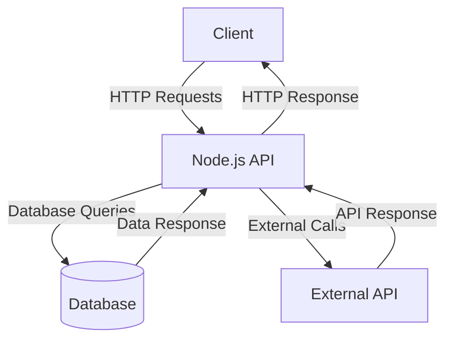

# Sample Node.js Application

This document provides an overview of a sample Node.js application, including its architecture and workflow.

## Application Architecture

The following diagram illustrates the architecture of the Node.js application:



## Workflow

The workflow of the application is described below:

1. The **Client** sends an HTTP request to the **Node.js API**.
2. The **API** processes the request and interacts with:
   - The **Database** for data storage and retrieval.
   - An **External API** for additional data or services.
3. The **API** consolidates the responses and sends an HTTP response back to the **Client**.

## Prerequisites

- [Node.js](https://nodejs.org/) (v14 or later)
- [npm](https://www.npmjs.com/) (Node Package Manager)
- A database (e.g., MongoDB, PostgreSQL)

## Installation

1. Clone the repository:
   ```bash
   git clone https://github.com/username/sample-nodejs-app.git
   cd sample-nodejs-app
   ```

2. Install dependencies:
   ```bash
   npm install
   ```

3. Configure environment variables in a `.env` file.

## Running the Application

Start the application with the following command:
```bash
npm start
```

## Useful Links

- [Node.js Documentation](https://nodejs.org/en/docs/)
- [Express.js Guide](https://expressjs.com/)
- [Mermaid Documentation](https://mermaid-js.github.io/mermaid/#/)
